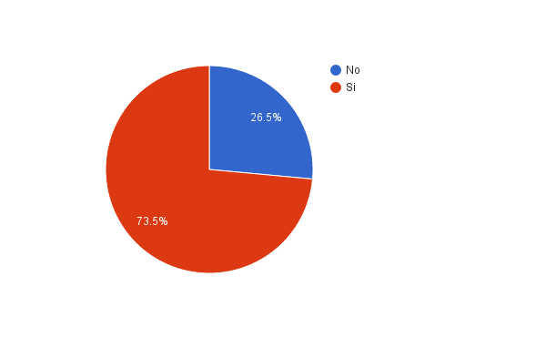
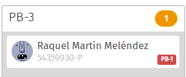

# Introducción

El enunciado de la práctica deja ver un problema que todos los alumnos
y profesores de esta facultad conocemos, el problema de los cambios de grupo.

En esta práctica, me he propuesto hacer la labor del profesor más sencilla,
mediante una interfaz de usuario interactiva fácil de usar y visual.

## ¿Por qué centrarse en la labor del profesor?

No hay un sólo motivo por el que me haya centrado en esta práctica en este tipo
de interfaz, sino varios.

Interfaz central a la labor:
  ~ Si hubiera una sóla interfaz en un sistema de intercambio de grupos, sería
    esta.

    Aunque los sistemas de manejo de cursos actuales contienen herramientas para
    realizar esta tarea @moodle-group-change, son herramientas subestándar
    que, a pesar de que cumplen su labor, no escalan bien con una cantidad de
    alumnos elevada como la de los cursos de la Universidad de Salamanca, y no
    tienen ninguna ayuda visual para indicar cuándo los grupos están
    equilibrados y cuándo no.

Carga centrada sobre un usuario:
  ~ El uso de esta interfaz recae sobre un sólo usuario, que además suele estar
    bastante ocupado. Además de eso, suele ser una tarea recurrente para varios
    cursos[^even-more].

[^even-more]: Incluso, se podría argumentar que el facilitar la tarea del
profesor beneficia a los alumnos, tanto directamente (más tiempo del profesor
para preparar mejores clases), como indirectamente (menos estrés del profesor,
que suele ser mejor para todos).

Interfaz más flexible:
  ~ Esta actividad es sin duda la que más flexibilidad permite en cuanto al
    diseño de interfaces. Hay millones de posibles formas de organizar $n$
    alumnos en $k$ grupos.

    Si bien es cierto que las otras posibles interfaces relacionadas dan también
    bastante juego, ninguna le da el mismo.

Desafío técnico:
  ~ Aparte de todos los argumentos expuestos arriba (y con un peso mucho menor),
    la interfaz diseñada es lo suficientemente compleja e interactiva como para
    justificar el aprender una tecnología nueva, en este caso *React JS*
    @react-intro.

## Proceso ideal en el que entraría esta interfaz

Esta interfaz ha sido ideada en un *workflow* similar al que sigue:

 1. Creación de los grupos y distribución de los alumnos de forma automática,
    preferiblemente dando a elegir entre aleatoria, ordenada alfabéticamente,
    etc. Tras esto, los alumnos son notificados.

 2. Cada alumno puede solicitar un cambio de un grupo a otro, pero sólo a un
    grupo a la vez. Esto quedaría registrado en algún tipo de base de datos, de
    la que la interfaz obtiene los datos de la composición de grupos actual.

 3. *(opcional)* Cuando los tamaños de los grupos lo permitan, un sistema
    automático podría llevar a cabo permutas entre dos alumnos que hayan elegido
    grupos contrarios.

 4. El profesor realizaría las permutas y cambios que él considerara oportuno
    desde esta interfaz, donde se ve tanto la composición de grupos actual como
    los grupos preferidos por cada alumno, en el caso de que existan.

    Este proceso podría necesitar ser llevado a varias veces, de ahí la
    necesidad para que esta interfaz sea intuitiva, fácil y rápida de usar.

# Análisis del *Estatus Quo* en cuanto al cambio de grupos

A pesar de que la interfaz desarrollada tiene un propósito muy concreto dentro
del proceso de cambio de grupo, considero valuable el conocer cuál es la
situación desde ambos lados.

## Desde el lado de los estudiantes

El lado de los estudiantes es conocido por experiencia, pero merece la pena
conocer la opinión de otros estudiantes, dado lo dependiente de este proceso del
profesor y de las herramientas utilizadas para organizar los grupos.

### Diseño del cuestionario

Con este propósito, se ha diseñado un cuestionario junto con otro compañero,
para conocer cuál es la forma preferida de los usuarios para realizar este tipo
de gestiones, y cómo han sido experiencias anteriores de cambio de grupo.

Las preguntas del cuestionario son las siguientes:

  * **¿Eres o has sido estudiante universitario?**

    Esta es una pregunta necesaria especialmente para saber si tratamos con
    estudiantes o antiguos estudiantes, o no estudiantes (en cuyo caso la
    encuesta no aplica demasiado).

  * **¿Qué consideras más cómodo de utilizar para realizar gestiones, móvil o PC
    (escritorio o portátil)?**

    Esta es una pregunta especialmente relevante para mi compañero, que se iba
    a centrar en la labor de los usuarios a la hora de solicitar cambios de
    grupo.

    No obstante también es útil para evaluar cómo prefiere la gente realizar sus
    gestiones.

  * **¿Te ayuda ver una foto de perfil de una persona para tratar con ella?**

    Esto nos ayudará potencialmente a tomar decisiones de diseño.

    En el caso del profesor deberemos ser cuidadosos para no darle demasiada
    relevancia de todas formas para evitar bias, ya que la apariencia del alumno
    no debería de ser un factor determinante en prácticamente ninguna decisión
    del profesor, aunque podría ser útil para conocer los alumnos.

  * **A la hora de realizar gestiones, ¿qué prefieres, realizarlo por internet
    o en una oficina?**

    Esta es una pregunta que debíamos incluir para tratar de no caer en dar
    demasiada relevancia a nuestra intuición.

    La respuesta que esperamos era una clara mayoría a favor de internet, pero
    tal vez la mejor solución es ir todos a la oficina una vez por curso.

  * **En caso de ser estudiante, ¿alguna vez has tenido que cambiar de grupo de
    clase?**

    Esta pregunta nos ayuda a tomar conciencia de la relevancia relativa del
    problema que estamos tratando, y a la vez a tratar de hacernos una idea de
    la cantidad de trabajo manual que tiene que realizar un profesor cada curso.

  * **¿Cuántos cambios de grupo has realizado el último curso que cursaste?**

    Con esta pregunta queremos averiguar dos cosas.

    Por una parte, mi compañero quiere saber si merece la pena diseñar su
    aplicación para una pequeña fracción de alumnos que realicen muchos cambios
    de grupo cada curso, o debe hacer algo más general.

    Por otra parte, a mi me ayuda para saber la cantidad de cambios por alumno
    que suele haber en un curso, para tratar de optimizar el diseño para ello.

  * **¿En caso de haber hecho algún cambio de grupo, fue sencilla tu gestión?**

    Esta respuesta es interesante para mi compañero principalmente, pero a mi me
    ayuda a tratar de diseñar una interfaz ubicable dentro de un proceso que sea
    óptimo para todas las partes, no exclusivamente la del profesor.

  * **¿En caso de que la respuesta fuera no, qué fue difícil del proceso? ¿Cómo lo
    mejorarías?**

    Esto nos ayuda a entender posibles casos patológicos, y que nuestro sistema
    se adecue a ello adecuadamente.

  * **¿Fue necesario que el profesor confirmara el cambio definitivamente,
    a pesar de que fuera una permuta?**

    Aunque esperamos una respuesta clara a esta pregunta, queremos confirmar que
    la mayor carga de trabajo recae sobre el profesor en estos casos.

### Resultados

Recibimos un total de **35 respuestas**, en su inmensa mayoría de estudiantes.
Abajo se encuentran los porcentajes de las respuestas aplicables[^applicable].

[^applicable]: Es decir, si alguien afirmaba que no era estudiante, no se le
contó para las respuestas referentes a cambios de grupo, al igual que si alguien
afirmaba que no había hecho ningún cambio de grupo, no se le contó en la cuenta
anual.




#### ¿Qué fue difícil del proceso? ¿Cómo lo mejorarías?

Estas respuestas se han dejado para el final porque su contenido era opcional,
y era un cuadro de escritura libre. Se recibieron un total de 5 respuestas:

> Demasiado complicado, tuve que enviar muchos mails y preocuparme de primero
> tratar con un compañero para después notificar al profesor.

> Permitiendo un sistema de permutas que funcione bien, no como DiaWeb.

> El sistema estaba anticuado.

> Lo más difícil fue encontrar a la persona para realizar la permuta.

> No se podía realizar el cambio de grupo porque ningún alumno quería cambiarse
> a mi grupo.

### Análisis

Considero este cuestionario bastante valuable para hacerse a una idea del estado
actual de los cambios de grupo desde el punto de vista de los alumnos: Por lo
general un proceso aceptable, pero **muy mejorable**, y con algunos casos
especialmente costosos de llevar (como cuando no sabes con quién contactar para
realizar una permuta).

Es un procedimiento por el que una gran mayoría de alumnos ha tenido que pasar,
y del cual se tiene de media (contando a los alumnos que no han realizado nunca
un cambio) tres cambios cada dos años (0.76 cambios al año).

La mejoría de este proceso recaería, sobre todo, en el profesor, que es el que
tiene que coordinar los cambios al final del 100% de los encuestados que
realizaron algún cambio.

### Propuesta de mejora del cuestionario

Tras ver (a posteriori) las respuestas de la gente a este cuestionario, se me
ocurren diversas mejoras que podrían hacerlo mucho más valuable.

La mayor mejora sería **poner más preguntas de respuesta libre**. Son sin duda
de las que más valor tienen, y cuando son contestadas suelen dar mucho contexto
y puntos de vista que no podrías encasillar en respuestas predefinidas. No
obstante, habría que encontrar un buen balance de respuestas libres y de
elección, porque las respuestas libres conllevan mucho más esfuerzo.

A posteriori, me hubiera gustado realizar la pregunta *¿Qué tipo de sistema
usaste para hacer el cambio de grupo?*, y haber hecho llegar la encuesta
a muchos más participantes. Sin duda hubiera sido mucho más útil que la mayoría
de preguntas más *precocinadas*.

## Desde el punto de vista del profesor

El punto de vista de los profesores parece bastante claro también (sobre todo
a juzgar por el enunciado de la práctica). No me he atrevido a sacar un
cuestionario por el departamento, aunque la evaluación final ha sido bastante
reveladora en ese aspecto.

Procederemos a un análisis de las herramientas de cambio de grupo actuales,
y porqué son así.

Ahora mismo hay dos formas de organizar los grupos de prácticas en la facultad:
Mediante *Moodle* y mediante *DIAWeb*. Ambos procesos son relativamente
similares, sin tener ningún tipo de automatización más allá que la asignación
original de los grupos, y especialmente **poco eficientes a la hora de resolver
conflictos**.

Mi hipótesis acerca de por qué es así, al menos en el caso de *Moodle*, es que
la gestión de los grupos es algo que, dependiendo del centro educativo, se usa
para propósitos muy diferentes, por lo que se ha tendido al mínimo común
denominador, con el propósito de que funcione en todos los casos, aunque no sea
el flujo de trabajo óptimo.

Por suerte, nosotros tenemos un caso de uso mucho más específico, por lo que
podemos hacer algo que se adapte mejor a él.

# Proceso de diseño de la interfaz

El proceso de diseño inicial de la interfaz fue, tal vez poco sorprendentemente,
directo. La idea básica en la cabeza del diseñador (es decir, yo), era clara,
y tener un prototipo inicial no costó demasiado.

A partir de ahí, gracias a diferentes evaluaciones y pruebas con usuarios, se
consiguió llegar al diseño actual.

# Aspectos y consideraciones tomadas a la hora de diseñar la interfaz

Durante el diseño de esta interfaz se han tomado algunas consideraciones
importantes relacionadas con el diseño.

## Tipografía

Se ha usado la tipografía Fira Sans, en su version *light* para los títulos
y nombres de grupo, y en su versión normal para el resto de elementos de la
página, lo que le da un aspecto consistente a la vez que ligero y no muy formal.

## Escalabilidad

El hecho de que funcionara para cualquier número de grupos y alumnos es
extremadamente importante. Para ello se usó FlexBox @css-flexbox, que permite
que los elementos fluyan si sobrepasan el ancho, pero mantienen los de la misma
fila con el mismo alto.

Si el alto número de alumnos o grupos fuera un problema mayor del previsto, se
podría considerar hacer el interior del recuadro del grupo scrollable
verticalmente.

## Accesibilidad

### Desde todo tipo de dispositivos

La página funciona bien independientemente de la resolución de pantalla y de si
se usa un ratón o un dedo para manejarlo. De hecho, se usa un back-end diferente
para la biblioteca de *drag and drop* si el navegador soporta touch-events o no:

```js
let selectedBackend = Html5Backend;
if (window.Modernizr && window.Modernizr.touchevents)
  selectedBackend = TouchBackend({ enableMouseEvents: true });
```

Sobre el tamaño de la pantalla, gracias a FlexBox no ha hecho falta nada más que
usar la etiqueta `<meta name="viewport">`.

```html
<meta name="viewport" content="width=device-width, initial-scale=1">
```

Nótese que aunque se hubiera podido utilizar el fragmento `user-scalable=no`,
para que el navegador no añada un delay artificial cuando se hace *drag and
drop* en los dispositivos móviles @mozhacks-touch-events, se ha elegido
mantener la capacidad de hacer zoom, pensando sobre todo en usuarios que
pudieran tener problemas de visión.

### Para todo tipo de personas

Se ha usado el módulo `react-a11y` para emitir errores si alguno de los
elementos básicos de accesibilidad se incumplía.

Esto sirvió en su momento para cazar un par de errores de accesibilidad de forma
automática, como etiquetas `` sin atributo `alt`, y controles de formulario
sin `label`, haciendo un poco más usable la interfaz para la gente que usa
lectores de pantalla.

## Colores consistentes y fáciles de reconocer

Casi todos los diferentes estados tanto de un grupo como de un alumno se han
indicado con colores fácilmente reconocibles y estándares dentro de la
industria:

  * Naranja para advertencias no críticas (por ejemplo, cuando un grupo no está
    balanceado).
  * Rojo para errores graves (como cuando un grupo está vacío).
  * Verde para aciertos o situaciones óptimas (por ejemplo, cuando un usuario
    está en un grupo deseado).



Los colores son similares a los estandarizados *"de facto"* por Bootstrap, pero
han sido escogidos a mano, por lo que me responsabilizo si hay algún fallo
grande a este respecto.

## Interacciones marcadas claramente

Todos los elementos que son susceptibles de interacción son marcados al paso del
ratón de una manera u otra. Este era uno de los problemas principales que se
encontraron cuando se probó con usuarios.

Así, por ejemplo, los elementos que se pueden arrastrar son marcados con un
cursor específico y son escalados al pasar el ratón, a la vez que adquieren una
sombra. Esto está hecho **para resemblar el acto de "coger una carta" y moverla
de sitio**, algo que parece que se entendió claramente durante las evaluaciones.

![Alumno arrastrable resaltado[^alumn-screenshot]](img/draggable-alumn.png)

[^alumn-screenshot]: Nótese que el cursor en la captura es el por defecto por
defecto del software de captura de pantalla.

Otro ejemplo de esto es que cuando estás arrastrando un alumno, los grupos donde
puedes dejarlo escalan también. Este gesto se hace por consistencia con el gesto
de escalado del alumno, y estoy bastante contento con el resultado del mismo.

![Grupo donde se puede dejar un alumno[^group-screenshot]](img/droppable-group.png)

[^group-screenshot]: Al igual que anteriormente, el cursor no se ve en este
caso, pero se encuentra sobre el alumno transparente en el grupo resaltado. Ante
la duda, se recomienda probar la aplicación directamente.

# Evaluación de la interfaz

Se realizaron varias evaluaciones diferentes: Dos por compañeros de curso, una
con un compañero de piso que tiene un caso de uso similar (más adelante doy
detalles), y finalmente una con una profesora, que además de actuar como
usuaria, actuó como experta, ya que tiene bastante trabajo realizado en el campo
del e-Learning y del uso de las tecnologías dentro de la educación.

Adicionalmente, los dos últimos compararon el proceso con el proceso equivalente
en Moodle.

Cada una de las evaluaciones fueron **extremadamente reveladoras**, y sirvió
para mejorar el proyecto de una manera que no me hubiera imaginado en principio.

## Tarea designada para la evaluación

Ninguna de las personas que probaron la aplicación tenía experiencia previa con
ella, y todas poseían la misma información:

> Este es un sistema de cambio de grupos. Tienes que ponerte en el papel de un
> profesor organizando un curso. Tu objetivo es conseguir organizar los grupos
> de tal manera que queden compensados, y de tratar de evitar todos los
> conflictos de horarios entre los alumnos.

Tras eso, yo observaba al usuario usando la aplicación, obviamente sin revelar
ninguna información acerca de cómo utilizarla.

Si completaban el primer paso de forma satisfactoria, les pedía lo siguiente:

> Te ha llegado un correo de un alumno que no sabe utilizar el sistema
> automático de solicitud de cambio de grupo.
>
> Su DNI es el 70912324-N, y su nombre es Emilio. ¿Podrías moverlo al grupo $X$?

Donde $X$ era el grupo con menos alumnos donde no estuviera el alumno
correspondiente.

La idea de esta pregunta era valorar la utilidad de la búsqueda.

A continuación haremos un pequeño repaso de las diferentes experiencias que
tuvieron los usuarios, y las lecciones aprendidas de ellas.

## Primer diseño y primera evaluación

El primer diseño era algo rudo, he de reconocerlo. Tenía varias carencias
a nivel de facilidad de uso.

El primer evaluador se llama Marcel, es estudiante de Física en Salamanca, y no
ha querido que sus otros dos apellidos salieran en este informe.

**El resultado de la primera evaluación fue catastrófico**: El usuario no supo
reordenar los grupos, porque no aparecía ninguna indicación con el cursor de que
se pudieran arrastrar los miembros de los grupos, lo cual fue un fallo enorme
por mi parte.

## Segunda iteración y evaluación

En la segunda iteración sobre el diseño se añadió el cursor con la mano, y los
efectos `:hover` y de drag.

La evaluadora en este caso se llama Raquel Martín García, y es una alumna de
Adventia que se ofreció para la evaluación.

Con este nuevo diseño, la evaluadora consiguió hacer los grupos
satisfactoriamente, aunque no consiguió resolver ningún conflicto.

En esta interfaz, lo que ahora es una "etiqueta" con el grupo deseado y un
color, era un punto de color que al pasar el ratón por encima mostraba el grupo.

La evaluadora no supo interpretar esto, y por lo tanto los conflictos entre
grupos quedaron sin resolver.

Sí que usó, no obstante, la búsqueda adecuadamente, si bien dijo que le parecía
extraño no poder ver ver el número de alumnos total del grupo mientras filtraba
(algo que no estaba en esa versión del diseño).

El resultado de esta evaluación **fue algo más satisfactorio**, aunque dejó en
evidencia que aún faltaban muchas cosas por pulir.

### Comparativa con Moodle

Tras esto se pidió a la entrevistada que hiciera un cambio de grupos similar con
una versión estándar de Moodle (inicialmente montada para la asignatura de
administración de sistemas).

La respuesta fue clara, y cito textualmente:

> No hay color, es que la versión de Moodle es una chusta.

## Tercera iteración y evaluación

La tercera interacción fue mucho más aceptable, a estas alturas ya se habían
incluido los cambios provocados por las anteriores iteraciones, aparte de
colores [estándar](https://flatuicolors.com/) en el diseño de interfaces para
mostrar grupos no balanceados.

En este caso el evaluador se llama Sergio Sanjurjo Gómez. Es miembro de la junta
directiva de la [asociación Supernova](http://ausupernova.esy.es). Dicha
asociación organiza actividades y observaciones para niños, y muchas de ellas
tienen un máximo de personas limitado, generalmente por la cantidad de material
que hay.

Hasta ahora estas actividades han sido organizadas con la cooperación de
diversos colegios, y por lo tanto han acabado delegando la organización de los
grupos a dichos colegios. No obstante quieren empezar a organizar eventos por su
cuenta o colaborando con otro tipo de instituciones que no tienen tanto control
sobre sus miembros (como pueblos, etc.), y expresaron su interés en un sistema
de resolución de conflictos de horario entre grupos para organizar sus
actividades.

Esto le un valor mucho mayor a esta evaluación porque fue realizada por alguien
realmente interesado en un sistema así (a pesar de que el caso de uso no fuera
exactamente el propuesto para la práctica).

La evaluación fue rápida y sin ninguna objeción[^no-objections-except]. El
entrevistado consiguió realizar las tareas solicitadas sin ninguna ayuda en
menos de un minuto por tarea, algo que considero todo un logro.

[^no-objections-except]: Salvo que los datos no se quedaban guardados cuando
recargaba, algo que quedaba fuera de lugar para este prototipo.

## Evaluación final y recorrido cognitivo

La evaluación final fue realizada por una profesora, familiar de mi novia, con
la que coincidí en una comida familiar.

Resultó ser algo llovido del cielo completamente ya que, a pesar de ser
profesora de primaria, está estudiando un doctorado y haciendo varios proyectos
acerca de e-Learning y el uso de las tecnologías dentro del sistema educativo.

La interacción con la aplicación fue grabada en vídeo (ver el fichero
`docs/video/cognitive-walkthrough.ogv`)[^bloopers].

[^bloopers]: Si quieres ver un intento de grabación fallido, ve el primer minuto
del archivo `docs/audio/cognitive-walkthrough-full.mp3`.

Por desgracia, esto dejó en evidencia que el uso de las etiquetas para remarcar
conflictos era aún subóptimo, y que algo de ayuda explícita para indicar qué
significaba sería necesario. Por otra parte, esto puede ser porque no identificó
los nombres `PB-1`, `PB-2`, etc. como nombres de grupo (por la poca relación con
nuestra facultad que tiene).

No he tenido tiempo de hacer este último retoque a la interfaz, tendría que
pensar cómo integrarlo en condiciones, o tal vez haciendo una página externa
sería suficiente...

En todo caso, de la conversación con Laura pude sacar varias conclusiones muy
importantes.

Comparando con el sistema de gestión de grupos de Moodle:

> Esto es mucho más visual que el otro, porque yo en el otro lo he hecho, he
> hecho grupos de trabajo, y al final me se los DNIs y los nombres y apellidos
> de todos los alumnos, que te cruzas y te dicen "¿Pero por qué se sabe
> esta...?"

Fue bastante gratificante el ver el esfuerzo en el diseño reconocido en sus
palabras, y extremadamente valuable su feedback.

# Conclusiones

En esta práctica se ha llevado a cabo el diseño de una interfaz usando los
principios del UCD.

Lo más remarcable de esta práctica en lo que a mi respecta, ha sido la extrema
utilidad del proceso de evaluación con los usuarios.

Concretamente, **a mi en la primera iteración me parecía un sistema
perfectamente claro y fácil de usar. Sin embargo, el primer usuario que lo probó
ni siquiera supo que podía arrastrar los usuarios**.

Sirva esta reflexión como reconocimiento personal a la importancia de las
técnicas relacionadas con el diseño centrado en el usuario.

Me hubiera gustado contar con más tiempo para haber podido hacer una evaluación
mucho más extensa, y una búsqueda de necesidades muchísimo más en profundidad,
no obstante los exámenes apremian.

Sinceramente, aunque no puedo decir que esta sea la disciplina que más me llama,
si que es verdad que he aprendido a valorarla muchísimo más gracias a las clases
de Interacción Persona-Ordenador, y a aprender el valor de las técnicas de
diseño, *need-finding* y evaluación, y que si en algún momento depende de mi una
decisión relacionada con el diseño de un producto lo aprendido en esta
asignatura va a estar presente cuando se tome.

# Apéndice

## Adjuntos

Aparte de las imágenes en esta memoria, se adjunta todo el código fuente, y un
vídeo con el proceso de evaluación cognitiva final.

## Ejecución del código fuente

Para poner a ejecutar la aplicación en local, sólo hay que ejecutar (en la
carpeta `src/`):

```
$ npm install
$ npm start
```

Y abrir el navegador en la URL `http://localhost:5000`.

No obstante, debería haber una versión online en
[emiliocobos.net/ipo](https://emiliocobos.net/ipo).

Se adjunta el repositorio en la carpeta, para que se puedan ver todas las etapas
del diseño al detalle usando `git log`, aunque los pasos principales han sido
delineados aquí.

## Pequeño tributo al SIGCHI

Se ha hecho con la bibliografía de esta memoria un pequeño tributo al ACM
SIGCHI, el grupo internacional de referencia en cuanto a Interacción
Persona-Ordenador, mediante el uso de su estilo de citaciones para la
bibliografía.

# Bibliografía
